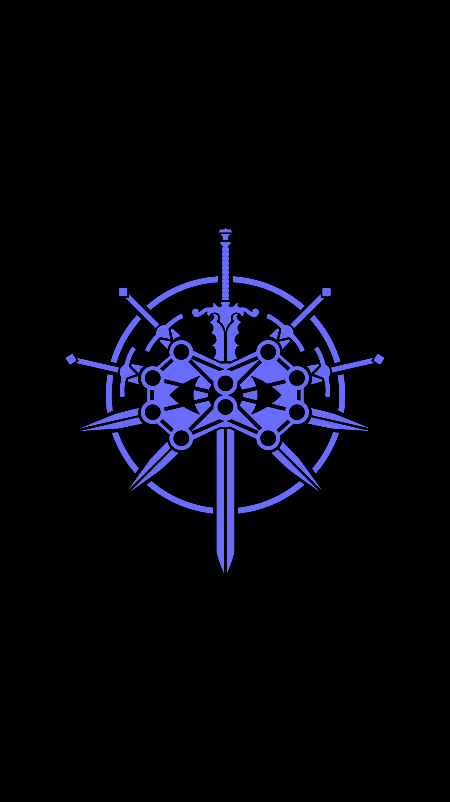

# Introduction
### Guiding Questions
- Where do the computers we have today come from?
- What exactly is a computer?
- How does a computer work?
- What is a computer network? How does it work?
- What is the Internet? How does it work?
- How can I be most effective in this tutorial?
***
In these first lessons, there is no prior knowledge assumed.
In fact, there is no designing, coding, or command line work here.
All you have to do is humor me by reading this section in full if you
are not familiar with some of these concepts. 
If you are uninterested and impatient, you are free to move on to the code.
However, concepts and terms learned here WILL be used throughout the rest
of the course. I urge you to be patient and *READ ACTIVELY*.

Let's begin...

# 00 - Foundations of Modern Computing

> *"Life before death. Strength before weakness. Journey before destination..."*
> 
> From *The Way of Kings*, by *Brandon Sanderson*

Indeed, you are about to embark upon a grand journey into a new field. This field
is rich, complex, and life-changing. You may find yourself struggling at times. Remember in that moment: *strength before weakness*. Do not give up! Just because
you haven't mastered everything in this tutorial, that doesn't mean you are not 
fully capable of learning through consistent and regular practice! You will reach
a point where it all begins to click, and then the possibilities are virtually unlimited!

I make no pretense of knowing everything. I was once like you. Completely lost
when it came to understanding computers. I still have to look things up to this 
day! Everyone does. Everyone has been a beginner. Keep moving forward! Let's go!

## 00.1 - History of the Computer, I guess
### 1800s - 1960s
A really long time ago, like the 1800s, there was this dude named [Charles Babbage](https://en.wikipedia.org/wiki/Charles_Babbage) and a dude named [George Boole](https://en.wikipedia.org/wiki/George_Boole). Now both of these dudes were mathematicians with some pretty RAD ideas. Long story short, Babbage came up with something that was, at the time, theoretical which he referred to as an [*analytical engine*](https://en.wikipedia.org/wiki/Analytical_Engine). 

This Analytical Engine had an **ALU (arithmetic logic unit)**, **control flow** with **branching** and **loops**, and **memory**. This made it the first **Turing-complete** general-purpose **computer**. What this basically means is that the Analytical Engine was logically the same as modern computer design. Don't worry, we'll define these terms soon. For now, just make note of any terms you don't know.
***
For the longest time, a computer was someone who crunched numbers for a living. Over the next century and a half, with the invention of the telephone, radio broadcasting, and the television, the field of computing would take off. Indeed, the human computer would become quite obsolete as faster and faster computational machines were devised and implemented.

...wHaT iN oBliViOn iS tHaT?!

~Plane flies in and drops leaflets with the message below~

*It's time for World War II!*

**The British**: OH NOE. The Germans are bombing us and taking over Europe and have encrypted their communications via machine. We're so SCREWED.

**Alan M. Turing**: Hello, yes, I would like one job breaking Nazi codes please.

**The British**: Sure why the hEcK not?

**Alan M. Turing**: Okay bros, what if we fight the machines with another machine?

**The British**: (them and the other allied powers defeat the Nazis)

**The British**: ...

**THe British**: tHAT wOrKeD?!

**Alan M. Turing**: You're welcome.

**The British**: You're gay.

**Alan M. Turing**: YES. Bye.
***
*Alan Turing was a great mathematician and often thought of as the father of computer science. There is much more to his story here: [Alan Turing - Wikipedia](https://en.wikipedia.org/wiki/Alan_Turing)*

***

With the Nazis defeated, the post-war world (well, in the West at least) quickly grew socially, economically, and technologically. 

### Late 1960s - Now
***
*Fun fact*: The United States went to the Moon on 4KB of RAM and a 32KB hard disk.
***

## 00.2 - History of the Internet, I guess

## 00.3 - How Computers Work

## 00.4 - How Computer Networks Work

## 00.5 - How the Internet Works

## 00.6 - Introducing Visual Studio Code

## 00.7 - Introducing Powershell & bash
Throughout this course, you will be making extensive use of the **command-line interface (CLI)**.
As a developer, it will become a most cherished tool. In the hands
of the skilled, it is a powerful and precise weapon and a merciful hero. In the hands of a noob, it is a blunt force of chaos and confusion
capable of destroying your system's stability!

Lucky for you, the only commands you need know for now are:
- **cd** (to change directories as in ``$cd ~/Desktop``)
- **ls** (to list all files and subfolders in a folder)
- **mv** (to move/rename folders and files)
- **cp** (to copy folders and files)
- **rm** (to delete files)
- **mkdir** (to make directories)
- **touch** (to make files)
- **cls/clear** (to clear the console output)
- **npm test** (to test your exercises)
- **node script.js** (or app.js or whatever .js file you are trying to run)

***
| Key Terms Introduced (full definitions in the [glossary](../../glossary.md)) |
| --------------------------- |
| ALU (Arithmetic Logic Unit) |
| Branching |
| Computer |
| Control Flow |
| Loops |
| Memory |
| Turing-complete |  

## Summary

