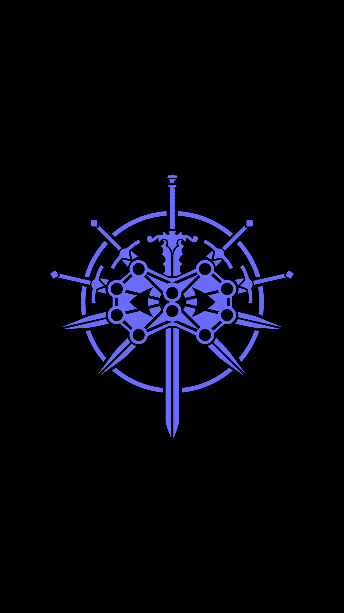

# Introduction
### Guiding Questions
- Where do the computers we have today come from?
- What exactly is a computer?
- How does a computer work?
- What is a computer network? How does it work?
- What is the Internet? How does it work?
***
In these first lessons, there is no prior knowledge assumed.
In fact, there is no designing, coding, or command line work here.
All you have to do is humor me by reading this section in full if you
are not familiar with some of these concepts. 
If you are uninterested and impatient, you are free to move on to the code.
However, concepts and terms learned here WILL be used throughout the rest
of the course. I urge you to be patient and *READ ACTIVELY*.

Let's begin...

# 00 - Foundations of Modern Computing

> *"Life before death. Strength before weakness. Journey before destination..."*
> 
> From *The Way of Kings*, by *Brandon Sanderson*

Indeed, you are about to embark upon a grand journey into a new field. This field
is rich, complex, and life-changing. You may find yourself struggling at times. Remember in that moment: *strength before weakness*. Do not give up! Just because
you haven't mastered everything in this tutorial, that doesn't mean you are not 
fully capable of learning through consistent and regular practice.

## 00.1 - History of the Computer, I guess

## 00.2 - History of the Internet, I guess

## 00.3 - 

